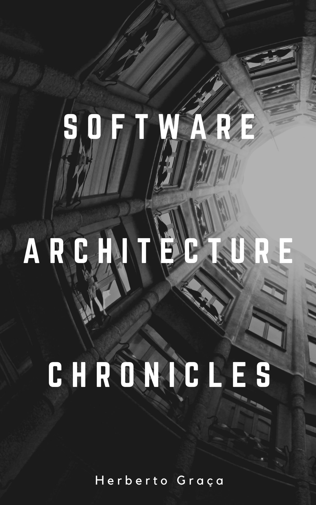

  <h1>The Software Architecture Chronicles</h1>
  

## Table of Contents

1.  [The Software Architecture Chronicles](content/ch01.md)
2.  [Software Architecture Premises](content/ch02.md)
3.  [Programming Language evolution](content/ch03.md)
4.  [Architectural Styles vs. Architectural Patterns vs. Design Patterns](content/ch04.md)
5.  [Monolithic Architecture](content/ch05.md)
6.  [Layered Architecture](content/ch06.md)
7.  [MVC and its alternatives](content/ch07.md)
    1.  [1979 -- Model-View-Controller](content/ch07.md#model-view-controller)
    2.  [1987/2000 -- PAC / Hierarchical Model-View-Controller](content/ch07.md#hierarchical-model-view-controller)
    3.  [1996 -- Model-View-Presenter](content/ch07.md#model-view-presenter)
    4.  [1998 --"Model 1″ & "Model 2"](ch7-4.md)
    5.  [2005 -- Model-View-ViewModel](content/ch07.md#model-view-view_model)
    6.  [???? -- Model-View-Presenter-ViewModel](content/ch07.md#model-view-presenter-view_model)
    7.  [2008 -- Resource-Method-Representation](ch7-7.md)
    8.  [2014 -- Action-Domain-Responder](ch7-8.md)
8.  [EBI Architecture](content/ch08.md)
9.  [Packaging & namespacing](content/ch09.md)
10. [Domain-Driven Design](content/ch10.md)
11. [Ports & Adapters Architecture (aka Hexagonal Architecture)](content/ch11.md)
12. [Onion Architecture](content/ch12.md)
13. [Clean Architecture](content/ch13.md)
14. [Event-Driven Architecture](content/ch14.md)
15. [From CQS to CQRS](content/ch15.md)
16. [Service Oriented Architecture (SOA)](content/ch16.md)
17. [Explicit Architecture \#01: DDD, Hexagonal, Onion, Clean, CQRS, ... How I put it all together](content/ch17.md)
18. [Explicit Architecture \#02: More than concentric layers](content/ch18.md)
19. [Explicit Architecture \#03: Reflecting architecture and domain in code](content/ch19.md)
20. [Explicit Architecture \#04: Documenting the architecture](content/ch20.md)
21. Evolving a project: from MVP to P
22. 4 + 1 Architecture view model
23. Architecture quality attributes

## TODO

- [ ] Proofread chapters
- [ ] Fix footnotes
- [ ] Merge chapters 7.4, 7.7 and 7.8 into chapter 7
